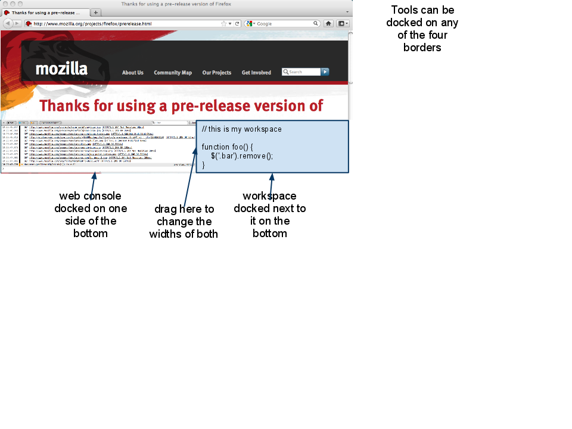
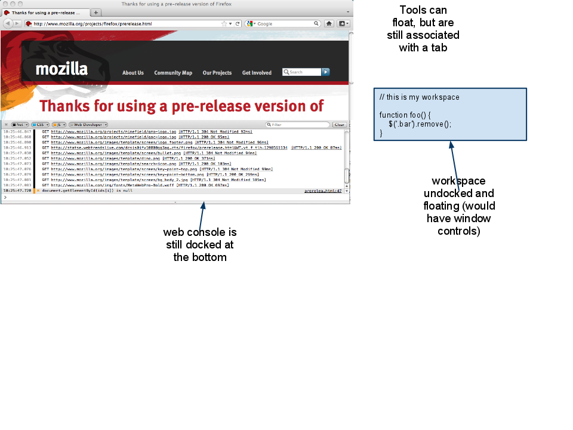
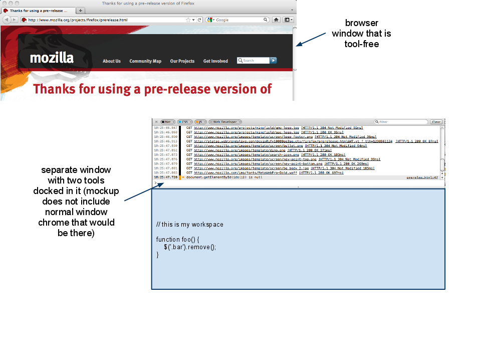

# Mozilla Developer Tools UI #

<table class="metadata">
    <tr><th>Revision</th><td>February 24, 2011</td></tr>
    <tr><th>Status</th><td>Design</td></tr>
    <tr><th>Feature Owner</th><td>Kevin Dangoor</td></tr>
</table>

Imagine a designer, we'll call him Leonardo. He's great at visual design
and has a moderate understanding of HTML and CSS. He doesn't know jQuery at
all, but has copied-and-pasted lines of jQuery code into his pages here
and there to get some animation. This is before he discovered CSS animation,
of course. Leonardo rarely uses his keyboard, preferring either a mouse
or stylus depending on what he's up to.

There's another Firefox user named Grace. Her web pages are wondrously
small (people looking at them wonder where all of the content is!). She
builds up elaborate UIs in JavaScript. She tried *all* of the JavaScript-based
toolkits and ended up writing her own. Twice. She uses JavaScript to generate
her CSS as well.

Leonardo and Grace don't have a lot in common.

We will be building a variety of developer tools that appeal to different 
audiences and provide a range of features. Some web developers will want
all of the tools. Others will only want some. We want to build the tools
so that:

* users who need few tools are able to use those tools with minimal fuss
* users who need many tools will find that they complement each other well
* no one feels like they're drowning in clutter

This document is intended to describe the concepts, features and interface
guidelines that will make the tools work together.

## Open Questions ##

1. Panels need to be floatable and dockable
2. what is the scope of panels and how does it change as you move between tabs?
3. how can panels that are frequently used together be denoted as such?
4. how do we handle "activation"? (Which sites the tools show up for automatically? which tools? how are they grouped? how do we keep expensive tools from slowing things down?)

# Panels #

* A blob of user interface that represents a specific tool
* Ideally, reusable in both Firebug and in the ways described below
* In our tools, they will be displayed in Jetpack Panel objects which wrap XUL Panel objects (albeit with new features that we need to add to them).

## Docked Panels ##

## Docked Panels, side-by-side ##

## Floating Panels ##

## Floating Tool Window ##

# Scope #

Each tool works in a particular "scope". For most users most of the time, the scope is simple and invisible: the tools are tied to the tab for which they were created. Tools *can* be given a new scope along the way (see below).

If the user switches tabs, any tool windows or floating panels will disappear (and any tools that were in use for the new tab will be displayed).

People who are working in browser chrome **(signaled by a pref?)** will have tools that are associated with chrome and do not change when the current tab changes.

A case that is under consideration (but should be considered out of project scope for the moment) is one like the current (as of Feb 24, 2011) Workspaces add-on. That add-on works in the scope of the current tab, so each time you evaluate an expression it is evaluated in a different scope. This is a less common use case and if we were to introduce it, we need to be careful about how that's surfaced in the UI.

# Gauges #

Another idea: add-ons could provide "gauges" which would generally be viewed together in a strip. Memory, CPU usage, network traffic, framerate. Anything that can be displayed in compact way.

# Alert Mechanism #

All installed tools should be able to alert the user, regardless of which tools are open. Note that this gets into the "activation problem" that Firebug has solved.

Alerts to consider:

1. this page is now consuming more than X memory
2. this page took more than Y time until document was ready

# Activation #

* console logging happens when console is closed
* all other tools are totally off
* user clicks **(something)** which turns on tools. That activates more logging, alerts and whatever gauges would be visible.
* expensive operations (debugging, profiling, memory snapshots) are all turned on via independent switches.

